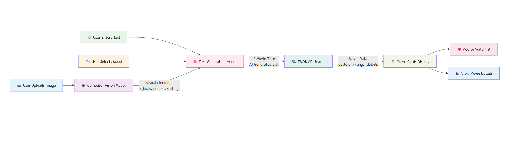

# 🎬 CineSuggest AI - A Movie Recommendation System based on your MOOD

> An intelligent movie recommendation system that uses computer vision and AI to suggest movies based on images, text descriptions, and mood preferences.



## 🌟 Features

- **🖼️ Image Analysis**: Upload any image and get movie recommendations based on visual elements
- **📝 Text Input**: Describe what you're looking for in natural language
- **🎭 Mood Selection**: Choose from various genres and moods to refine recommendations
- **🤖 AI-Powered**: Uses advanced computer vision and text generation models
- **❤️ Watchlist**: Save movies to your personal watchlist
- **📱 Responsive Design**: Beautiful UI that works on all devices
- **⚡ Real-time**: Fast recommendations with loading animations

## 🚀 How It Works

```
📷 Image Upload → 🤖 AI Analysis → 🎬 Movie Titles → 🔍 Movie Search → 📋 Results
     +              +                  +                +              +
📝 Text Input   →   👁️ Computer    →   📚 Text      →   🎭 TMDB     →   💻 Display
     +              Vision Model      Generation         API             Cards
🎭 Mood Select  →                     Model          →                →
```

### Step-by-Step Process:

1. **User Input**: Upload an image, add text description, or select a mood
2. **Computer Vision**: AI analyzes the image to extract visual elements (objects, people, settings, mood)
3. **Text Generation**: Advanced AI model combines visual analysis with user preferences to generate 10 specific movie titles
4. **Movie Search**: System searches TMDB (The Movie Database) for each recommended title
5. **Results Display**: Beautiful movie cards with posters, ratings, and details are displayed
6. **Watchlist**: Users can save movies to their personal watchlist

## 🛠️ Tech Stack

### Frontend
- **React.js** - Modern UI framework
- **Styled Components** - Component-level styling
- **Framer Motion** - Smooth animations
- **Axios** - API communication
- **React Router** - Navigation

### Backend
- **Node.js** - Server runtime
- **Express.js** - Web framework
- **MongoDB** - Database for movies and watchlists
- **Mongoose** - MongoDB object modeling
- **Multer** - File upload handling
- **Sharp** - Image processing

### AI & APIs
- **Computer Vision Model** - Image analysis and object detection
- **Text Generation Model** - Intelligent movie recommendation generation
- **TMDB API** - Movie database and metadata
- **Hugging Face API** - AI model hosting

## 📁 Project Structure

```
movie-app/
├── frontend/                    # React frontend
│   ├── src/
│   │   ├── components/         # UI components
│   │   │   ├── Layout/        # Navigation and layout
│   │   │   ├── Discover/      # Main recommendation page
│   │   │   ├── Movies/        # Movie cards and grid
│   │   │   ├── Watchlist/     # Saved movies page
│   │   │   └── Toast/         # Notifications
│   │   ├── contexts/          # State management
│   │   ├── utils/             # API utilities
│   │   └── styles/            # Global styles and themes
│   └── public/
├── backend/                     # Node.js backend
│   ├── controllers/           # Route handlers
│   ├── models/                # Database schemas
│   ├── routes/                # API routes
│   ├── services/              # Business logic
│   │   ├── huggingfaceAiService.js  # AI integration
│   │   └── tmdbService.js     # Movie database API
│   ├── middleware/            # Custom middleware
│   └── uploads/               # Temporary image storage
└── README.md
```

## 🚀 Quick Start

### Prerequisites
- Node.js (v14 or higher)
- MongoDB (local or Atlas)
- TMDB API key
- Hugging Face API token

### Installation

1. **Clone the repository**
   ```bash
   git clone https://github.com/yourusername/cineai-movie-recommender.git
   cd cineai-movie-recommender
   ```

2. **Backend Setup**
   ```bash
   cd backend
   npm install
   ```

3. **Frontend Setup**
   ```bash
   cd ../frontend
   npm install
   ```

4. **Environment Configuration**
   
   Create `backend/.env`:
   ```env
   PORT=5000
   NODE_ENV=development
   MONGODB_URI=mongodb://localhost:27017/movie-app
   TMDB_API_KEY=your_tmdb_api_key_here
   TMDB_BASE_URL=https://api.themoviedb.org/3
   HUGGINGFACE_API_TOKEN=your_huggingface_token_here
   UPLOAD_DIR=./uploads
   ```

   Create `frontend/.env`:
   ```env
   REACT_APP_API_URL=http://localhost:5000/api
   REACT_APP_TMDB_IMAGE_BASE_URL=https://image.tmdb.org/t/p/w500
   ```
## 🎯 Usage Examples

### 1. Image-Based Recommendations
- Upload a dark, moody photograph
- Expected result: Thriller and psychological drama recommendations

### 2. Text-Based Recommendations
- Input: "romantic movies like Titanic"
- Expected result: Classic and modern romance films

### 3. Mood-Based Recommendations
- Select: "🖤 Dark & Intense"
- Expected result: Noir, thriller, and psychological movies

### 4. Combined Input
- Upload: Cityscape at night + Text: "cyberpunk themes" + Mood: "Sci-Fi"
- Expected result: Blade Runner, Ghost in the Shell, Matrix-style movies

## 🔧 API Endpoints

### Movies
- `POST /api/movies/recommend` - Get AI recommendations
- `GET /api/movies/popular` - Get popular movies
- `GET /api/movies/genres` - Get movie genres
- `GET /api/movies/:id` - Get movie details

### Watchlist
- `GET /api/watchlist` - Get user's watchlist
- `POST /api/watchlist` - Add movie to watchlist
- `DELETE /api/watchlist/:movieId` - Remove from watchlist

### Health & Testing
- `GET /api/health` - Health check
- `GET /api/test/ai-status` - Check AI models status

## 🤖 AI Models Used

### Computer Vision Model
- **Purpose**: Analyzes uploaded images to extract visual elements
- **Output**: Objects, people, settings, colors, and mood detected in images
- **Examples**: "person, indoor, dark, sitting" → psychological thriller recommendations

### Text Generation Model
- **Purpose**: Generates specific movie titles based on visual analysis and user input
- **Input**: Combined visual elements + user text + mood preferences
- **Output**: List of 10 relevant movie titles

## 🔄 System Flow

1. **Input Processing**
   - Validate user inputs (at least one required)
   - Optimize uploaded images for AI processing
   - Combine text and mood preferences

2. **AI Analysis**
   - Computer vision model analyzes visual elements
   - Text generation model creates movie recommendations
   - Fallback system ensures reliability

3. **Movie Search**
   - Search TMDB for each recommended title
   - Fetch movie metadata (posters, ratings, descriptions)
   - Handle API errors and retries

4. **Result Display**
   - Create beautiful movie cards
   - Show AI analysis insights
   - Enable watchlist interactions

## 🚨 Error Handling

The system includes comprehensive error handling:

- **AI Model Failures**: Fallback to intelligent recommendation system
- **Network Issues**: Retry logic and graceful degradation
- **File Upload Errors**: Size limits and format validation
- **API Limits**: Rate limiting and error messages

## 📝 License

This project is licensed under the MIT License - see the [LICENSE](LICENSE) file for details.

## 🙏 Acknowledgments

- **TMDB** for providing comprehensive movie data
- **Hugging Face** for AI model hosting and APIs
- **React Community** for excellent documentation and tools
- **MongoDB** for reliable database services

---
